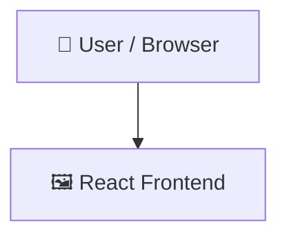

# FocoJá

> A React web application built with Vite and modern JavaScript.

   

## 📑 Table of Contents

- [Description](#description)
- [Key Features](#key-features)
- [Use Cases](#use-cases)
- [Screenshots](#screenshots)
- [Tech Stack](#tech-stack)
- [Architecture](#architecture)
- [Quick Start](#quick-start)
- [Key Dependencies](#key-dependencies)
- [Available Scripts](#available-scripts)
- [Project Structure](#project-structure)
- [Development Setup](#development-setup)
- [Contributors](#contributors)
- [Contributing](#contributing)

## 📝 Description

FocoJá is a React frontend web application powered by Vite. Designed as a lightweight single-page application setup, it provides a clean structure for developing interactive user interfaces using React and modern JavaScript standards.

The application bootstraps from src/main.jsx using React DOM client rendering wrapped in StrictMode. CSS styling is imported via src/styles/index.css, while Vite handles local development with Hot Module Replacement (HMR) and production build bundling.

## ✨ Key Features

<!-- - **⚡ Vite Build Tooling** — Uses Vite for rapid local development with Hot Module Replacement and optimized production builds.
- **⚛️ React Component Structure** — Renders standard React components wrapped in React StrictMode for modular frontend UI development.
- **🧹 Linting and Formatting** — Includes configured npm scripts to run code quality checks across the project. -->

## 🎯 Use Cases

<!-- - Developing dynamic single-page web applications using React and Vite.
- Prototyping frontend client interfaces with rapid HMR reloads. -->

## 📸 Screenshots


## 🛠️ Tech Stack

  

## 🏗️ Architecture

A high-level view of how the main pieces fit together:



## ⚡ Quick Start

```bash

# 1. Clone the repository
git clone https://github.com/Juanvic/foco_ja.git

# 2. Install dependencies
npm install

# 3. Start the dev server
npm run dev
```

## 📦 Key Dependencies

```
react: ^19.2.8
react-dom: ^19.2.8
react-router-dom: ^7.18.2
```

## 🚀 Available Scripts

- **dev** — `npm run dev`
- **build** — `npm run build`
- **lint** — `npm run lint`
- **preview** — `npm run preview`

## 📁 Project Structure

```
.
├── index.html
├── package.json
├── public
│   ├── favicon.svg
│   └── icons.svg
├── src
│   ├── App.css
│   ├── App.jsx
│   ├── assets
│   │   ├── icons
│   │   │   ├── focoja.svg
│   │   │   ├── react.svg
│   │   │   └── vite.svg
│   │   └── images
│   │       └── hero.png
│   ├── components
│   │   └── layout
│   │       ├── Footer.jsx
│   │       └── Header.jsx
│   ├── main.jsx
│   ├── pages
│   │   ├── Inicio.jsx
│   │   ├── Sobre.jsx
│   │   └── Todo.jsx
│   └── styles
│       ├── Footer.css
│       ├── Header.css
│       ├── Todo.css
│       └── index.css
└── vite.config.js
```

## 🛠️ Development Setup

### Node.js / JavaScript
1. Install Node.js (v18+ recommended)
2. Install dependencies: `npm install` (or `yarn` / `pnpm install` / `bun install`)
3. Start the dev server: see the **Quick Start** above


